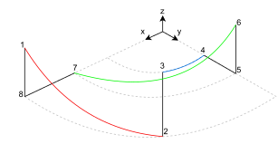
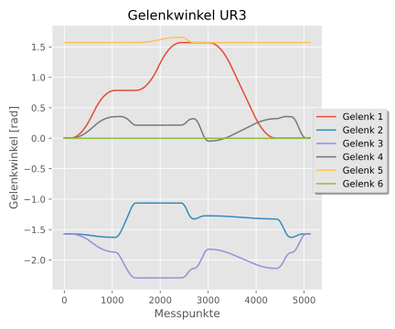
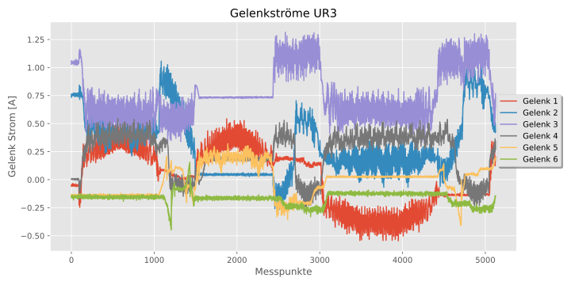
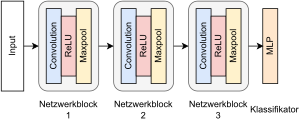
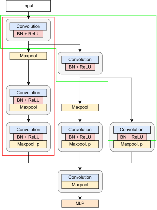
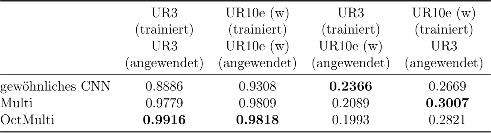

# Design of a Procedure for Automatically Generating Semantic Device Description using Artificial Neural Networks

## Motivation
Semantic device descriptions (SDD) are formal models to describe the hierachy of sensors and actuators within a
technical enviroment or machinery.
They provide explicit information about signals and their meaning. Therefore they are vital for maintenance, dataanalysis
and exchange, SCADA-systems and integration in preexisiting production enviroments.
Typically they are specified in the design phase of a greenfield system. In contrast they have to be manually
defined for brownfield systems.

This repo includes an approach to automatically generate SDDs from signal channels of device controls.
The approach utilizes a Convolutional Neural Network (CNN) to automatically assign sensor signals from a robot control
to its provenance.
By letting the Tool-Center-Point of the robot follow a distinct movement path the generated sensor signals
are unique and mostly comparable for similiar robots. Therefore the CNN can identify uniqe signal patterns and
assign the signal to its component of provenance. At last a subquent module transforms the CNNs classification to a
SDD for the device. The SDD is displayed in XML or Text format. The approach is evaluated on two industrial robots. 

## Requirements
Requirements for a conda enviroment are saved in `automatic_sdd_bachelor.yml`.

For creating a conda environment `run conda env create -f automatic_sdd_bachelor.yml` in your terminal.

## Path
Since the patterns of the joint angles are easy to modify, the used movement path is optimized
to have the following properties:
- uniqe patterns
- comparable to other industrial robots
- rotation invariance

Utilizing polar coordinates, circular movements are identified to be rotation invariant.
In order to generate unique signal patterns for each joint, three different radii, two height levels and three
anglepositions are employed.
The circular movements are marked by color (cf. Bild). The base coordinate system of the robot matches with the coordinate system shown in Fig. 1.
The movement path is defined by forward kinematics.

**Fig. 1: chosen movementpath of TCP**

## Datasets
For the generation of the datasets two UR10e, one UR3 and one simulated Kuka KR 22 R1610.
The UR10es are labeled in the datasets as UR10e (w) and UR10e (f).
While the UR10e (w) works fine, in the study it was detected that the UR10e (f) has some kind of failure, which causes
the sensor signals to vary greatly from the UR3 and UR10e (w).
The generated datasets can be accessed [here](https://drive.google.com/drive/folders/1u6-OKzCOKDtTjJiqgA42-w1v7ETKdwzS?usp=sharing).

 

**Fig. 2: Excerpt one one employed dataset from UR3: Joint Angles (left) and Joint Current (right)**

## Methods
Three CNN approaches were adopted to classify the signal channels in the dataset.
The first model was adopted as a baseline. Here a CNN with three layers with ReLU activation functions and Maxpooling
was used (cf. Fig. 3). Additionally for the second model the branches of the MCNN (Cui2016) were modified with a 
fully-convolutional-network (FCN), the baseline as well as a mixture of both (cf. Fig. 3).
A three layer MLP was used as the classifier.
The third model has the same struture as the second model, but uses octave convolutions without further modification.

 

**Fig. 3: Employed models: Baseline CNN with three layers (left), Multi (right)** 

## Results
The channels of one robot is unique, but mostly different for other robots.
Therefore classification of unknown channels within the same dataset as trained is performing well.
The transfer to a different dataset shows weak results.

**Tab. 1: Classification results for signal channel identification. Accuracy (left) and F1-Score (right) are used as metric to evaluate the three CNN
architectures.**

 

## Acknowledgment
Special thanks to Univ.-Prof. Dr.-Ing Christian Kreischer, M.Sc. Christopher Klitsch and M.Sc. Ilja Dick for allowing the usage of their UR10e and UR3.

## Author
Alexander Guhl, student mechanical engineering

## Project status
Ongoing

## LICENSE
Licensed under the Apache License, Version 2.0 (the "License"); you may not use it except in compliance with the License. A copy of the License is included in the project, see the file LICENSE.**
